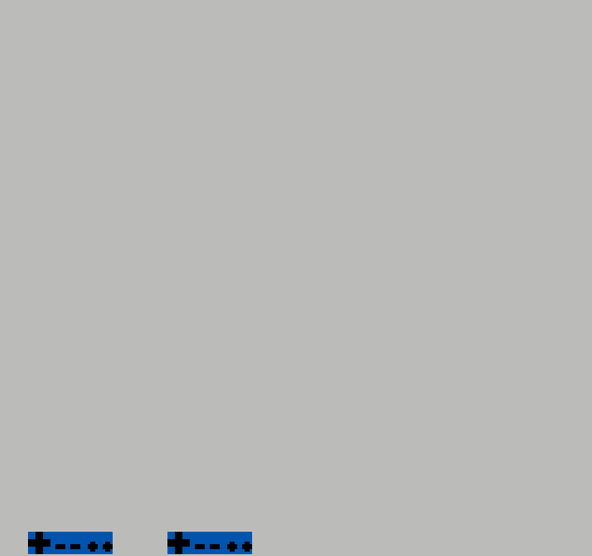

# Exemple de programme simple sur NES

- Fait défiler un sprite de gauche à droite en continu;
- Le sprite alterne entre les tuiles des caractères 1, 2, ..., 9;
- Lorsqu'on appuie sur le bouton A, le sprite se déplace vers le bas.

